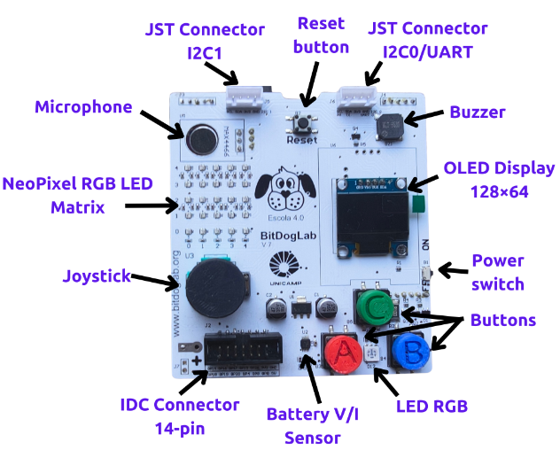

# Projeto Final — IA Embarcada e Modelos Compactos

**Disciplina:** UC "IA Embarcada e Modelos Compactos" — UniSENAI

**Professor:** MSc. Rodrigo Kobashikawa Rosa

**Grupo:** Rosemeri Borges, Denise Maciel e Andre Joas

## O que esse projeto faz

Detector de palavras faladas (Keyword Spotting) que roda 100% offline no
microcontrolador RP2040 da placa **BitDogLab v6.3**. Você fala uma das
palavras-alvo no microfone e a placa reage acendendo um pictograma
correspondente na matriz de LEDs 5x5 e mostrando o label no display OLED.

<p align="center">
  
  <br/>
  <em>BitDogLab v6.3 — Raspberry Pi Pico W + matriz WS2812 5×5 + OLED + microfone, tudo já soldado de fábrica.</em>
</p>

**Palavras reconhecidas:**

| Palavra (EN) | Pictograma 5x5  | Cor      |
| ------------ | --------------- | -------- |
| `happy`*     | smiley          | amarelo  |
| `yes`        | check ✓         | verde    |
| `no`         | X               | vermelho |
| `stop`       | mão de pare     | vermelho |
| `silence`    | matriz apagada  | -        |
| `unknown`    | ponto de interr.| azul     |

> \* **Estado validado em maio/2026:** a placa reconhece `yes`, `no` e `stop` com
> alta confiança. `happy` tem acurácia menor por dois motivos somados: o
> Speech Commands v2 tem cerca de 3× menos amostras de `happy` que das
> outras palavras-alvo (treino desbalanceado), e sotaque PT-BR amplifica a
> dificuldade do modelo (que foi treinado com falantes de inglês). O
> pipeline completo está validado — a limitação é específica de `happy`.

## Atende ao escopo do projeto final

A descrição oficial (`Descrição do projeto final.pdf`) pede 4 etapas — todas
contempladas:

1. **Coleta de dados de sensores** → microfone analógico da BitDogLab, ADC do RP2040 amostrando a 16 kHz via DMA
2. **Treinamento de um modelo com dataset público** → Google Speech Commands v2 (dataset oficialmente sugerido pelo prof na Aula 6, slide 39)
3. **Conversão e compressão do modelo para embarcá-lo** → Keras → TFLite int8 → array C de ~50 KB
4. **Pipeline de inferência no dispositivo** → captura áudio → mel spectrogram (40 bins) → DS-CNN quantizada → softmax → driver dos LEDs/OLED

## Estrutura do repositório

```
Projeto_final/
├── README.md               ← este arquivo
├── COMO_TESTAR.md          ← passo-a-passo Windows: instalar, compilar, flashar, testar
│
├── treino/
│   └── treino_kws.ipynb    ← notebook Colab: baixa dataset, treina, quantiza, exporta C
│
├── firmware/               ← projeto Pico SDK em C/C++
│   ├── CMakeLists.txt
│   ├── main.c              ← loop principal
│   ├── audio.[ch]          ← ADC + DMA → buffer de 16 000 amostras/segundo
│   ├── features.[ch]       ← FFT + filterbank Mel → tensor 49×40×1
│   ├── inference.[cc/h]    ← wrapper TFLite Micro
│   ├── led_matrix.[ch]     ← driver da matriz 5x5 WS2812 (PIO)
│   ├── ws2812.pio          ← programa PIO pro protocolo WS2812
│   ├── pictograms.[ch]     ← 6 ícones 5x5 (um por classe)
│   ├── display.[ch]        ← rotinas de alto nível pro OLED
│   ├── ssd1306.[ch]        ← driver low-level do OLED via I2C
│   ├── ssd1306_font.h      ← fonte 8x8
│   └── model_data.[ch]     ← modelo treinado convertido em array C
│
├── modelos/                ← saída do treino
│   ├── model.tflite        ← modelo quantizado int8 (~45 KB)
│   ├── model_data.c        ← idem, em array C
│   └── model_data.h        ← parâmetros de quantização
│
└── docs/
    ├── arquitetura.md      ← visão de blocos pra apresentação
    └── perguntas_prof.md   ← preparação pras 5 min de perguntas individuais
```

## Como reproduzir

O projeto já vem com modelo treinado (`modelos/model.tflite`) e firmware
compilado (`firmware/build/kws_bitdoglab.uf2`). Para recompilar do zero,
ver `COMO_TESTAR.md`.

**Demo na placa física (5 min):**
1. Conectar a BitDogLab segurando `BOOTSEL` enquanto pluga o USB-C
2. Arrastar `firmware/build/kws_bitdoglab.uf2` pra unidade `RPI-RP2`
3. Falar perto do microfone: `yes`, `no` ou `stop`
4. Ver pictograma na matriz 5×5 + label no OLED

**Retreinar o modelo:** abrir `treino/treino_kws.ipynb` no Google Colab
(GPU T4 gratuita), `Run all` (~15-20 min), substituir `firmware/model_data.c`
pelo arquivo baixado e recompilar.

## Hardware

- **Placa:** BitDogLab v6.3 (Raspberry Pi Pico W, RP2040, dual-core Cortex-M0+)
- **Microfone:** eletreto analógico (GY-MAX4466) já soldado, lido via ADC no GPIO28
- **Saída visual 1:** matriz WS2812 5x5 (25 LEDs RGB) no GPIO7, driver PIO
- **Saída visual 2:** OLED SSD1306 128x64 via I2C (GPIO14=SDA, GPIO15=SCL)
- **Conexão com PC:** cabo USB-A para USB-C (vem no kit)

## Stack de software

| Camada                | Tecnologia                                     |
| --------------------- | ---------------------------------------------- |
| Treino do modelo      | Python 3.10 + TensorFlow 2.16 + Keras          |
| Quantização           | `tf.lite.TFLiteConverter` int8 com calibração  |
| Runtime no MCU        | TensorFlow Lite for Microcontrollers           |
| Porte pro RP2040      | `pico-tflmicro` (porte oficial da Raspberry Pi)|
| FFT                   | kissFFT (single header, BSD)                   |
| HAL/SDK do MCU        | Raspberry Pi Pico SDK 2.x                      |
| Build                 | CMake + arm-none-eabi-gcc                      |
| Flash                 | Arrastar `.uf2` pra unidade BOOTSEL            |

## Métricas-alvo

- Tamanho do modelo: < 60 KB de flash
- Tensor arena: < 30 KB de RAM
- Latência de inferência: < 200 ms
- Acurácia (4 palavras + 2 classes especiais): > 85% no test set

## Referências

- Google Speech Commands v2: https://www.tensorflow.org/datasets/catalog/speech_commands
- pico-tflmicro (porte oficial): https://github.com/raspberrypi/pico-tflmicro
- TensorFlow MicroSpeech (modelo de referência): https://github.com/tensorflow/tflite-micro/tree/main/tensorflow/lite/micro/examples/micro_speech
- BitDogLab-C (exemplos oficiais): https://github.com/BitDogLab/BitDogLab-C
- End-to-end tinyML audio no RP2040 (TF Blog): https://blog.tensorflow.org/2021/09/TinyML-Audio-for-everyone.html
